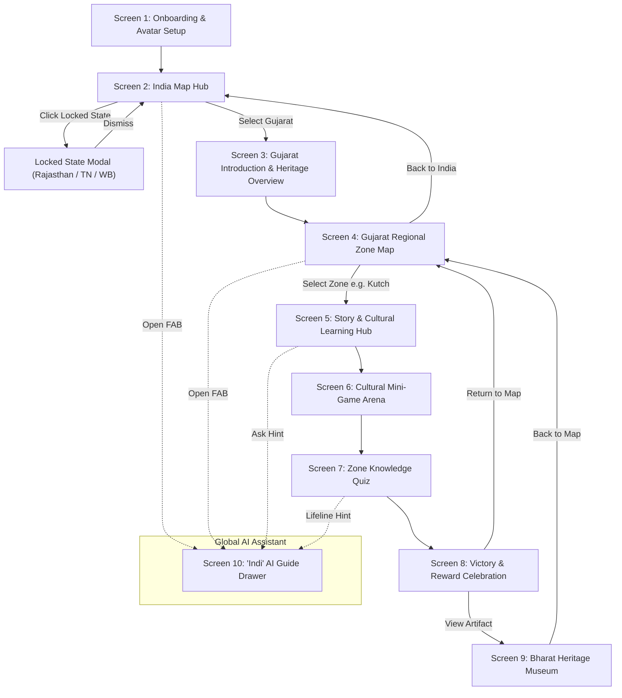
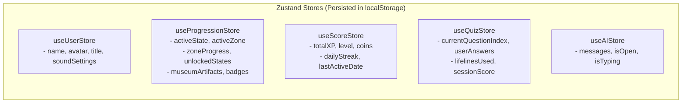
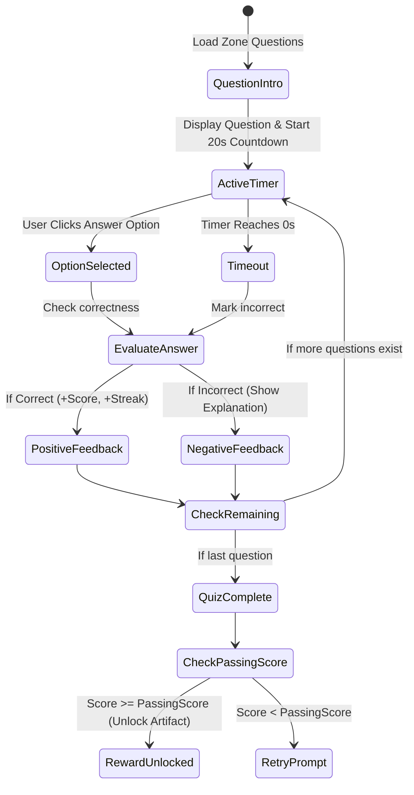

# BharatVerse — SIH 2026 Prototype Technical & UX Architecture

> **Project Concept**: Interactive gamified cultural learning metaverse exploring Indian states.  
> **Scope for Hackathon Prototype**: Single playable state (**Gujarat**) with locked preview states (**Rajasthan, Tamil Nadu, West Bengal**).  
> **Primary Tech Stack**: React / Next.js (or Vite + React + TypeScript), Tailwind CSS, Framer Motion, Zustand, Lucide Icons, Canvas/HTML5 Mini-games, Google Gemini Flash API (via `@google/genai`).

---

## Table of Contents
1. [All Screens & UX Wireframe Specs](#1-all-screens--ux-wireframe-specs)
2. [Navigation & State Flow](#2-navigation--state-flow)
3. [Component Hierarchy & Design System](#3-component-hierarchy--design-system)
4. [Application State Architecture](#4-application-state-architecture)
5. [TypeScript Data Schemas & Gujarat Dataset](#5-typescript-data-schemas--gujarat-dataset)
6. [Folder Structure](#6-folder-structure)
7. [Asset Pipeline & Requirements](#7-asset-pipeline--requirements)
8. [Game Progression & State Mastery System](#8-game-progression--state-mastery-system)
9. [XP, Scoring & Streak Math](#9-xp-scoring--streak-math)
10. [Unlock System & Gatekeeping Logic](#10-unlock-system--gatekeeping-logic)
11. [Quiz Engine Architecture](#11-quiz-engine-architecture)
12. [Mini-Game Architecture & Specifications](#12-mini-game-architecture--specifications)
13. [Responsive UI / UX Behavior](#13-responsive-ui--ux-behavior)
14. [Accessibility (a11y) & Inclusive Design](#14-accessibility-a11y--inclusive-design)
15. [Hackathon Prototype Success Criteria & Demo Checklist](#15-hackathon-prototype-success-criteria--demo-checklist)

---

## 1. All Screens & UX Wireframe Specs

### Screen 1: Splash & Explorer Onboarding (`/onboarding`)
* **Purpose**: Instant zero-friction entry, avatar selection, sound preferences.
* **Layout**:
  * **Hero Background**: Dynamic cultural mandala particle animation or vibrant saffron-indigo gradient.
  * **Header**: "BharatVerse" with glowing Ashoka emblem / cultural compass logo.
  * **Main Card**:
    * Name input: "Enter Explorer Name" (default: "Yatri").
    * Avatar Carousel: 4 cultural explorer avatars (Veer, Ananya, Kabir, Diya) with distinct regional motifs.
    * Sound/Music toggle switch (BGM on/off).
  * **CTA Button**: "Begin Your Yatra (Explore India) →"

---

### Screen 2: India Interactive Map Hub (`/map`)
* **Purpose**: National geography overview and state selection.
* **Layout**:
  * **Top HUD**:
    * Left: Avatar, Explorer Title (*"Novice Traveler"*), Level & XP Bar.
    * Center: National Flag badge + "National Heritage Discovered: 1/28".
    * Right: Bharat Coins count, Museum Shortcut Icon, AI Guide trigger.
  * **Center Stage**: Interactive vector SVG map of India.
    * **Gujarat**: Highlighted in glowing emerald/gold, pulsing pin, label *"PLAYABLE — Land of Legends"*. Hovering displays preview card (4 Zones, 12 Collectibles, Mini-Games).
    * **Rajasthan, Tamil Nadu, West Bengal**: Marked with subtle lock icons and *"Coming Soon / National Tour"* teaser tooltips.
    * **Remaining States**: Grayed out with subtle border outlines.
  * **Bottom Drawer**: Quick stats & "State of the Day" cultural trivia banner.

---

### Screen 3: Gujarat State Introduction Hero (`/state/gujarat/intro`)
* **Purpose**: Immersive cultural hook before diving into map exploration.
* **Layout**:
  * **Hero Banner**: High-impact illustration of Rann of Kutch & Gir Asiatic Lion.
  * **Audio Greeting**: Auto/tap play audio: *"Kem Cho! Welcome to Gujarat"*.
  * **Cultural Highlights Grid (4 Pillars)**:
    1. *Heritage & Architecture* (Rani ki Vav, Somnath).
    2. *Wildlife & Nature* (Gir Forest, White Rann).
    3. *Crafts & Handloom* (Patola, Rogan Art, Bandhani).
    4. *Cuisine & Festivities* (Garba, Uttarayan, Gujarati Thali).
  * **Indi AI Bubble**: "I am Indi, your heritage guide! I'll travel with you across all 4 zones of Gujarat."
  * **CTA**: "Enter Gujarat Expedition Map →"

---

### Screen 4: Gujarat Regional Zone Map (`/state/gujarat`)
* **Purpose**: Main hub for Gujarat with 4 unlockable exploration zones.
* **Layout**:
  * **Map Viewport**: Stylized 2.5D illustrated SVG map of Gujarat with 4 interactive regional POIs:
    1. **Kutch Region** (North-West) — White Desert & Artisans.
    2. **Saurashtra / Gir** (South-West) — Asiatic Lions & Temple Architecture.
    3. **Ahmedabad & Central** (East) — Sabarmati Heritage & Street Food Culture.
    4. **Ekta Nagar / South** (South-East) — Statue of Unity & Engineering Pride.
  * **POI Pin Indicators**:
    * Icon representing the zone theme.
    * Progress indicator: 3 micro-badges (Story 📖, Game 🎮, Quiz 🏆).
    * Status: `Active`, `In-Progress`, or `Mastered`.
  * **Zone Drawer**: Clicking a pin slides out the Zone Expedition Card with "Start Mission".

---

### Screen 5: Story & Cultural Learning Hub (`/state/gujarat/zone/:zoneId/story`)
* **Purpose**: Bite-sized interactive storytelling with audio-visual immersion.
* **Layout**:
  * **Story Deck**: 3–4 swipeable story cards (Instagram Stories / Comic strip format).
  * **Card Elements**:
    * Vivid cultural illustration.
    * Short 2-sentence bite-sized narrative.
    * Audio pronunciation button (e.g., *"Rann Utsav"*, *"Undhiyu"*).
    * Interactive "Did You Know?" flip card.
  * **Bottom Bar**: Progress dots, "Ask Indi about this" AI prompt chip, and "Proceed to Mini-Game (+50 XP)" CTA.

---

### Screen 6: Cultural Mini-Game Arena (`/state/gujarat/zone/:zoneId/game`)
* **Purpose**: Kinesthetic learning reinforcement through fast-paced fun mini-games.
* **Game 1 (Kutch)**: *Garba Rhythm Beats* (Dandiya rhythm timing game).
* **Game 2 (Ahmedabad)**: *Gujarati Thali Master* (Drag-and-drop regional dish curation).
* **Game 3 (Gir)**: *Safari Wildlife Spotter* (Spot and capture rare fauna in Gir).
* **HUD**: Score counter, Timer (45s), Combo counter, Pause/Quit button.
* **Completion Overlay**: Star rating (1–3 Stars), mini-game score converted to Coins & XP.

---

### Screen 7: State Knowledge Quiz (`/state/gujarat/zone/:zoneId/quiz`)
* **Purpose**: Assessment to cement cultural learnings and unlock museum artifacts.
* **Layout**:
  * **Header**: Question 1 of 4, Timer ring (20s per question), Streak Flame `🔥 x3`.
  * **Lifelines**: `50:50` (eliminates 2 options), `Indi AI Hint` (gives cultural clue).
  * **Question Card**: Rich question text + optional image reference.
  * **Options**: 4 large touch-friendly button choices with instant feedback:
    * Green ripple + celebratory chime for correct.
    * Gentle red shake + instant educational explanation snippet for incorrect.
  * **CTA**: "Next Question →"

---

### Screen 8: Reward Celebration & Unlock Modal (`/celebration`)
* **Purpose**: High-dopamine gamification milestone.
* **Layout**:
  * Confetti canvas animation (`canvas-confetti`).
  * Big animated 3D badge/artifact pop-in (e.g. *Golden Charkha* or *Patola Silk Weave*).
  * Reward breakdown: `+200 XP`, `+50 Bharat Coins`, `Museum Artifact Unlocked`.
  * Action buttons:
    * "Inspect in Museum 🏛️"
    * "Next Zone Expedition 🗺️"

---

### Screen 9: Bharat Heritage Museum (`/museum`)
* **Purpose**: Personal trophy room and digital collectible gallery.
* **Layout**:
  * **Filter Bar**: `All`, `Gujarat (4/4)`, `Rajasthan (0/4 Locked)`, `Badges`.
  * **Artifact Grid**: Showcase cards displaying collected 3D-styled items with rarity tiers (*Common*, *Rare*, *Legendary*).
  * **Artifact Detail Modal**:
    * 360 degree card flip.
    * Cultural significance & historical provenance.
    * Real-world location map link (e.g., "Visit Sabarmati Ashram in Ahmedabad").
    * Audio narration snippet.

---

### Screen 10: "Indi" — The AI Cultural Companion (`Floating Drawer`)
* **Purpose**: Intelligent conversational assistant powered by Gemini API.
* **Layout**:
  * Persistent Floating Action Button (FAB) at bottom-right of every screen.
  * Side drawer / bottom sheet containing chat history with Indi.
  * Quick-prompt suggestion chips:
    * *"Tell me a folktale about Kutch!"*
    * *"What are the ingredients in authentic Dhokla?"*
    * *"Why are Asiatic lions only found in Gujarat?"*
  * Multilingual capability: English, Hindi, and Gujarati responses.
  * Voice synthesis toggle (Text-to-Speech).

---

## 2. Navigation & State Flow



---

## 3. Component Hierarchy & Design System

### Design System Tokens
* **Color Palette**:
  * *Primary (Saffron/Marigold)*: `#FF9933` / `#E67300`
  * *Secondary (Peacock Teal)*: `#008080` / `#005C5C`
  * *Heritage Gold*: `#D4AF37` / `#AA8010`
  * *Rann White / Pearl*: `#F8F9FA`
  * *Background Dark (Night Festival)*: `#0F172A`
  * *Card Surface*: `#1E293B` (with glassmorphism backdrop blur `backdrop-blur-md`)
* **Typography**:
  * Headings: `Cinzel` / `Rozha One` / `Poppins` (Bold & Indian Cultural feel)
  * Body: `Inter` / `Plus Jakarta Sans`

### Component Tree Hierarchy
```text
src/
├── components/
│   ├── layout/
│   │   ├── AppShell.tsx               # Wrapper with sound, background, & Indi FAB
│   │   ├── TopHUD.tsx                 # Profile, Level, XP bar, Coins, Museum icon
│   │   ├── BottomDock.tsx             # Quick navigation tabs (Map, Museum, Quests)
│   │   └── SoundManagerModal.tsx      # Background music & SFX volume control
│   ├── map/
│   │   ├── IndiaSvgMap.tsx            # Interactive Vector India Map with state paths
│   │   ├── StatePin.tsx               # Animated pulse pin for states
│   │   ├── GujaratZoneMap.tsx         # SVG/Canvas regional map of Gujarat
│   │   ├── ZonePin.tsx                # Status badge pin for Gujarat zones
│   │   └── LockedStateModal.tsx       # Teaser card for non-playable states
│   ├── story/
│   │   ├── StoryCardDeck.tsx          # Swipeable container with progress indicators
│   │   ├── StorySlide.tsx             # Image, text, pronunciation button
│   │   └── DidYouKnowFlipCard.tsx     # 3D flippable trivia card
│   ├── games/
│   │   ├── MiniGameContainer.tsx      # Common HUD (Timer, Score, Pause, Quit)
│   │   ├── GarbaRhythmGame.tsx        # Dandiya beat tapping canvas game
│   │   ├── ThaliBuilderGame.tsx       # Food item drag-and-drop game
│   │   └── SafariSpotterGame.tsx      # Click-to-spot wildlife game
│   ├── quiz/
│   │   ├── QuizEngine.tsx             # Question orchestrator, timer, score logic
│   │   ├── TimerProgressRing.tsx      # Animated SVG circular countdown
│   │   ├── LifelineBar.tsx            # 50:50 and AI hint trigger buttons
│   │   └── AnswerOptionCard.tsx       # Option button with animated feedback states
│   ├── rewards/
│   │   ├── RewardCelebrationModal.tsx # Canvas confetti + XP counter roll-up
│   │   ├── ArtifactCard.tsx           # 3D tilt collectible card with rarity shine
│   │   └── BadgeItem.tsx              # SVG icon badge with tooltip
│   ├── museum/
│   │   ├── MuseumGrid.tsx             # Categorized collectible display
│   │   └── ArtifactDetailViewer.tsx   # Modal with historical provenance & audio
│   └── ai-guide/
│       ├── IndiFAB.tsx                # Floating animated avatar button
│       ├── IndiChatDrawer.tsx         # Sliding drawer for AI chat
│       ├── MessageBubble.tsx          # Markdown rendered AI response with TTS
│       └── PromptSuggestions.tsx      # Quick contextual suggestion pills
```

---

## 4. Application State Architecture

To keep the architecture simple, fast, and 100% offline-resilient for a hackathon team, we use **Zustand** (or React Context) with automatic `localStorage` persistence.



### Store Slices

#### 1. `useUserStore`
```typescript
interface UserState {
  name: string;
  avatarId: string;
  title: string;
  soundEnabled: boolean;
  sfxVolume: number;
  bgmVolume: number;
  setProfile: (name: string, avatarId: string) => void;
  toggleSound: () => void;
}
```

#### 2. `useProgressionStore`
```typescript
interface ZoneProgress {
  zoneId: string;
  storyCompleted: boolean;
  gameScore: number;
  gameStars: number;
  quizScore: number;
  isMastered: boolean;
}

interface ProgressionState {
  unlockedStates: string[]; // ['gujarat']
  activeStateId: string;
  activeZoneId: string | null;
  zoneProgress: Record<string, ZoneProgress>; // { 'kutch': { ... }, 'gir': { ... } }
  unlockedArtifactIds: string[]; // ['patola-saree', 'gir-lion-trophy']
  unlockedBadgeIds: string[];
  completeStory: (zoneId: string) => void;
  recordGameScore: (zoneId: string, score: number, stars: number) => void;
  recordQuizScore: (zoneId: string, score: number) => void;
  unlockArtifact: (artifactId: string) => void;
  unlockBadge: (badgeId: string) => void;
  resetProgress: () => void;
}
```

#### 3. `useScoreStore`
```typescript
interface ScoreState {
  totalXP: number;
  coins: number;
  level: number;
  streakDays: number;
  addXP: (amount: number) => { leveledUp: boolean; newLevel: number };
  addCoins: (amount: number) => void;
}
```

---

## 5. TypeScript Data Schemas & Gujarat Dataset

### Core Data Models (`/src/types/index.ts`)

```typescript
export interface StateData {
  id: string;
  name: string;
  tagline: string;
  capital: string;
  coverImage: string;
  greetingAudioUrl?: string;
  greetingText: string;
  description: string;
  pillars: {
    heritage: string[];
    wildlife: string[];
    crafts: string[];
    cuisine: string[];
  };
  zones: ZoneData[];
  artifacts: ArtifactData[];
}

export interface ZoneData {
  id: string;
  name: string;
  region: string;
  coordinates: { x: number; y: number }; // Relative percentage coordinates for map (0-100)
  icon: string;
  shortDescription: string;
  story: StoryChapter;
  miniGame: MiniGameConfig;
  quiz: QuizConfig;
}

export interface StorySlide {
  id: string;
  title: string;
  subtitle: string;
  content: string;
  imageUrl: string;
  audioPronunciation?: string;
  didYouKnow: string;
}

export interface StoryChapter {
  id: string;
  title: string;
  slides: StorySlide[];
  rewardXP: number;
}

export type MiniGameType = 'rhythm-tap' | 'food-sorter' | 'safari-spotter';

export interface MiniGameConfig {
  id: string;
  type: MiniGameType;
  title: string;
  instructions: string;
  durationSeconds: number;
  targetScore: number;
  rewardXP: number;
  assets?: Record<string, string>;
}

export interface QuizQuestion {
  id: string;
  question: string;
  options: [string, string, string, string];
  correctAnswerIndex: number;
  explanation: string;
  culturalFact: string;
  aiHint: string;
  imageUrl?: string;
}

export interface QuizConfig {
  id: string;
  title: string;
  questions: QuizQuestion[];
  passingScore: number;
  rewardXP: number;
  unlocksArtifactId: string;
}

export interface ArtifactData {
  id: string;
  name: string;
  zoneId: string;
  category: 'Heritage' | 'Craft' | 'Nature' | 'Monument';
  rarity: 'Common' | 'Rare' | 'Legendary';
  thumbnailUrl: string;
  description: string;
  historicalContext: string;
  realWorldLocation: string;
}
```

### Complete Gujarat Mock Dataset (`/src/data/states/gujarat.ts`)

```typescript
export const GUJARAT_DATA: StateData = {
  id: 'gujarat',
  name: 'Gujarat',
  tagline: 'Land of Legends, Lions & Legacy',
  capital: 'Gandhinagar',
  coverImage: '/assets/states/gujarat/cover.webp',
  greetingText: 'Kem Cho! Welcome to Gujarat',
  description: 'From the crystalline white deserts of Kutch to the ancient roar of Asiatic lions in Gir, explore the vibrant culture, architecture, and flavors of Gujarat.',
  pillars: {
    heritage: ['Rani ki Vav (Stepwell)', 'Sun Temple Modhera', 'Somnath Temple'],
    wildlife: ['Asiatic Lions (Gir)', 'Wild Ass Sanctuary', 'Flamingos of Kutch'],
    crafts: ['Patan Patola Weaving', 'Rogan Art of Nirona', 'Bandhani Tie-Dye'],
    cuisine: ['Dhokla & Khandvi', 'Undhiyu Feast', 'Kathiyawadi Thali']
  },
  zones: [
    {
      id: 'kutch',
      name: 'Great Rann of Kutch',
      region: 'North-West Gujarat',
      coordinates: { x: 28, y: 32 },
      icon: 'sparkles',
      shortDescription: 'Endless white salt desert, moonlit Rann Utsav & ancestral Rogan art.',
      story: {
        id: 'kutch-story',
        title: 'The Moonlit Salt Desert & Artisan Guilds',
        rewardXP: 50,
        slides: [
          {
            id: 'k1',
            title: 'The White Symphony',
            subtitle: 'Rann of Kutch',
            content: 'The Great Rann is one of the largest salt deserts in the world. During the full moon of Rann Utsav, the desert shines like a sea of silver diamonds.',
            imageUrl: '/assets/states/gujarat/kutch_desert.webp',
            didYouKnow: 'The Rann is underwater during the monsoon and dries up into white salt crust in the winter!'
          },
          {
            id: 'k2',
            title: 'Preserving 300-Year-Old Rogan Art',
            subtitle: 'Master Crafts of Nirona',
            content: 'Rogan art uses boiled castor oil mixed with natural pigments. Using a thin metal rod, masters paint intricate floral tapestries without ever touching the fabric with their hands.',
            imageUrl: '/assets/states/gujarat/rogan_art.webp',
            didYouKnow: 'Only one single family in the village of Nirona preserves the original Rogan painting technique today.'
          }
        ]
      },
      miniGame: {
        id: 'kutch-game',
        type: 'rhythm-tap',
        title: 'Garba Dandiya Rhythm Tap',
        instructions: 'Tap the Dandiya sticks exactly when the festive rhythm ring hits the center target to keep the Garba circle moving!',
        durationSeconds: 40,
        targetScore: 300,
        rewardXP: 100
      },
      quiz: {
        id: 'kutch-quiz',
        title: 'Master of the White Desert',
        passingScore: 3,
        rewardXP: 150,
        unlocksArtifactId: 'rogan-tree-of-life',
        questions: [
          {
            id: 'q1',
            question: 'What natural oil is boiled and used as the primary base for traditional Rogan art?',
            options: ['Mustard Oil', 'Castor Oil', 'Coconut Oil', 'Sesame Oil'],
            correctAnswerIndex: 1,
            explanation: 'Rogan art is crafted using boiled castor oil mixed with natural earth pigments to create a pliable paint paste.',
            culturalFact: 'The word "Rogan" comes from Persian, meaning oil or varnish.',
            aiHint: 'Think of an oil crop widely cultivated in arid Gujarat regions for industrial and medicinal use.'
          },
          {
            id: 'q2',
            question: 'Which annual cultural festival celebrates the full moon over the White Desert of Kutch?',
            options: ['Tarnetar Fair', 'Rann Utsav', 'Modhera Dance Festival', 'Shamlaji Fair'],
            correctAnswerIndex: 1,
            explanation: 'Rann Utsav is a four-month winter celebration showcasing Kutchi music, dance, crafts, and tent cities under the moon.',
            culturalFact: 'Thousands of artisans gather here every winter to showcase Kutchi embroidery.',
            aiHint: 'The festival carries the name of the desert itself.'
          },
          {
            id: 'q3',
            question: 'What unique migratory bird gathers in millions in the flaming marshes of Kutch?',
            options: ['Greater Flamingo', 'Siberian Crane', 'Peacock', 'Great Indian Bustard'],
            correctAnswerIndex: 0,
            explanation: 'The Kutch desert is known as "Flamingo City", the largest breeding colony of Greater and Lesser Flamingos in Asia.',
            culturalFact: 'The salt brine produces rich algae that give flamingos their vibrant pink hue.',
            aiHint: 'These long-legged birds turn pink due to the algae they eat in the salt pans.'
          }
        ]
      }
    },
    {
      id: 'gir-saurashtra',
      name: 'Gir Forest & Saurashtra',
      region: 'South-West Gujarat',
      coordinates: { x: 38, y: 72 },
      icon: 'shield-alert',
      shortDescription: 'The last sanctuary of the Asiatic Lion & the sacred coastal Somnath temple.',
      story: {
        id: 'gir-story',
        title: 'The Lion\'s Roar & Sacred Shrines',
        rewardXP: 50,
        slides: [
          {
            id: 'g1',
            title: 'The King of Asia',
            subtitle: 'Gir National Park',
            content: 'Gir Forest is the sole global habitat of the majestic Asiatic Lion (Panthera leo persica), protected through remarkable coexistence with the local Maldhari pastoral tribe.',
            imageUrl: '/assets/states/gujarat/gir_lion.webp',
            didYouKnow: 'Asiatic lions have a characteristic longitudinal fold of skin running along their belly, distinguishing them from African lions!'
          }
        ]
      },
      miniGame: {
        id: 'gir-game',
        type: 'safari-spotter',
        title: 'Gir Forest Wildlife Tracker',
        instructions: 'Scan the scrub forest canopy and spot the hidden wildlife before the sunset timer expires!',
        durationSeconds: 30,
        targetScore: 250,
        rewardXP: 100
      },
      quiz: {
        id: 'gir-quiz',
        title: 'Guardian of Saurashtra',
        passingScore: 2,
        rewardXP: 150,
        unlocksArtifactId: 'bronze-gir-lion',
        questions: [
          {
            id: 'gq1',
            question: 'What makes the Asiatic Lion of Gir distinct from its African counterpart?',
            options: ['Spot patterns on body', 'Longitudinal belly skin fold', 'Larger mane in males', 'Webbed paws'],
            correctAnswerIndex: 1,
            explanation: 'Asiatic lions possess a unique skin fold along their belly and slightly shorter manes allowing their ears to remain visible.',
            culturalFact: 'The Nawab of Junagadh first enacted strict protection for the remaining 20 lions in the early 1900s.',
            aiHint: 'Look at the distinctive anatomical fold running across the lower abdomen.'
          }
        ]
      }
    },
    {
      id: 'ahmedabad-central',
      name: 'Ahmedabad Heritage & Flavors',
      region: 'Central Gujarat',
      coordinates: { x: 55, y: 48 },
      icon: 'utensils',
      shortDescription: 'India’s first UNESCO World Heritage City, Sabarmati Ashram & vibrant street cuisine.',
      story: {
        id: 'ahm-story',
        title: 'The Charkha & The Culinary Tapestry',
        rewardXP: 50,
        slides: [
          {
            id: 'a1',
            title: 'Cradle of Non-Violence',
            subtitle: 'Sabarmati Ashram',
            content: 'Situated on the tranquil banks of the Sabarmati River, this ashram was the headquarters for Mahatma Gandhi’s historic 1930 Dandi Salt March.',
            imageUrl: '/assets/states/gujarat/sabarmati.webp',
            didYouKnow: 'Ahmedabad was declared India’s first UNESCO World Heritage City in 2017 for its historic Pols (neighborhoods).'
          }
        ]
      },
      miniGame: {
        id: 'ahm-game',
        type: 'food-sorter',
        title: 'Gujarati Thali Master',
        instructions: 'Assemble an authentic 5-course Gujarati Thali (Dhokla, Thepla, Khandvi, Undhiyu, Shrikhand) to satisfy festive guests!',
        durationSeconds: 45,
        targetScore: 400,
        rewardXP: 100
      },
      quiz: {
        id: 'ahm-quiz',
        title: 'Scholar of the Heritage City',
        passingScore: 2,
        rewardXP: 150,
        unlocksArtifactId: 'golden-charkha',
        questions: [
          {
            id: 'aq1',
            question: 'Which legendary 1930 peaceful march against British salt taxation began at Sabarmati Ashram?',
            options: ['Dandi March', 'Bardoli Satyagraha', 'Kheda Movement', 'Quit India Movement'],
            correctAnswerIndex: 0,
            explanation: 'Mahatma Gandhi walked 384 km from Sabarmati Ashram to the coastal village of Dandi to produce salt from seawater.',
            culturalFact: '78 satyagrahis accompanied Gandhi on the 24-day journey.',
            aiHint: 'Named after the coastal town in Navsari district where salt was gathered.'
          }
        ]
      }
    },
    {
      id: 'patan-north',
      name: 'Patan & Rani ki Vav',
      region: 'North Gujarat',
      coordinates: { x: 52, y: 25 },
      icon: 'landmark',
      shortDescription: 'Intricate 7-level subterranean stepwell architecture & double-ikkat Patola silk.',
      story: {
        id: 'pat-story',
        title: 'Inverted Temples & Double Ikkat Silk',
        rewardXP: 50,
        slides: [
          {
            id: 'p1',
            title: 'Queen’s Stepwell of Waters',
            subtitle: 'Rani ki Vav',
            content: 'Built in the 11th century by Queen Udayamati, Rani ki Vav is an inverted temple descending 7 levels underground with over 500 principal sculptures of Vishnu avatars.',
            imageUrl: '/assets/states/gujarat/rani_ki_vav.webp',
            didYouKnow: 'Rani ki Vav is featured on the back of the official Indian ₹100 currency note!'
          }
        ]
      },
      miniGame: {
        id: 'pat-game',
        type: 'rhythm-tap',
        title: 'Patola Pattern Weaver',
        instructions: 'Match geometric warp and weft silk threads in rhythm to weave a royal Patola motif!',
        durationSeconds: 35,
        targetScore: 300,
        rewardXP: 100
      },
      quiz: {
        id: 'pat-quiz',
        title: 'Master of Patan Architecture',
        passingScore: 2,
        rewardXP: 150,
        unlocksArtifactId: 'patola-silk-heirloom',
        questions: [
          {
            id: 'pq1',
            question: 'On which denomination of the Indian Rupee banknote is Rani ki Vav illustrated?',
            options: ['₹50', '₹100', '₹200', '₹500'],
            correctAnswerIndex: 1,
            explanation: 'The Reserve Bank of India issued the lavender ₹100 banknote featuring Rani ki Vav to celebrate UNESCO World Heritage.',
            culturalFact: 'The stepwell was submerged in silt for centuries until the ASI excavated it in the 1980s.',
            aiHint: 'Check the purple/lavender banknote common in Indian currency.'
          }
        ]
      }
    }
  ],
  artifacts: [
    {
      id: 'rogan-tree-of-life',
      name: 'Rogan "Tree of Life" Tapestry',
      zoneId: 'kutch',
      category: 'Craft',
      rarity: 'Legendary',
      thumbnailUrl: '/assets/artifacts/rogan_tree.webp',
      description: 'Hand-painted castor oil textile art representing eternal nature and Kutchi artisan mastery.',
      historicalContext: 'Preserved by the Khatri family of Nirona village, gifted to world leaders as national treasures.',
      realWorldLocation: 'Nirona Village, Kutch District, Gujarat'
    },
    {
      id: 'bronze-gir-lion',
      name: 'Gir Asiatic Lion Emblem',
      zoneId: 'gir-saurashtra',
      category: 'Nature',
      rarity: 'Rare',
      thumbnailUrl: '/assets/artifacts/gir_lion_emblem.webp',
      description: 'Commemorative emblem celebrating the global sanctuary of the Asiatic Lion.',
      historicalContext: 'Recognizes the harmonious coexistence between the Maldhari tribals and wild lion prides.',
      realWorldLocation: 'Sasan Gir, Junagadh, Gujarat'
    },
    {
      id: 'golden-charkha',
      name: 'Sabarmati Heritage Charkha',
      zoneId: 'ahmedabad-central',
      category: 'Monument',
      rarity: 'Rare',
      thumbnailUrl: '/assets/artifacts/charkha.webp',
      description: 'The iconic spinning wheel symbolizing self-reliance, freedom, and peaceful revolution.',
      historicalContext: 'Used by Mahatma Gandhi at Hriday Kunj, Sabarmati to produce Khadi cloth.',
      realWorldLocation: 'Sabarmati Ashram, Ahmedabad, Gujarat'
    },
    {
      id: 'patola-silk-heirloom',
      name: 'Patan Double-Ikkat Patola Weave',
      zoneId: 'patan-north',
      category: 'Craft',
      rarity: 'Legendary',
      thumbnailUrl: '/assets/artifacts/patola_silk.webp',
      description: 'Double-ikkat silk where both warp and weft threads are tie-dyed before weaving, taking up to 6 months per saree.',
      historicalContext: 'Worn by Solanki royalty in the 12th century; colors remain vibrant for over 300 years.',
      realWorldLocation: 'Patan Heritage Salvi Guild, Gujarat'
    }
  ]
};
```

---

## 6. Folder Structure

```text
bharatverse/
├── public/
│   ├── assets/
│   │   ├── audio/
│   │   │   ├── bgm-folk-ambient.mp3
│   │   │   ├── kem-cho-greeting.mp3
│   │   │   ├── sfx-correct.mp3
│   │   │   ├── sfx-wrong.mp3
│   │   │   ├── sfx-unlock.mp3
│   │   │   └── sfx-tap.mp3
│   │   ├── avatars/
│   │   │   ├── veer.webp
│   │   │   ├── ananya.webp
│   │   │   ├── kabir.webp
│   │   │   └── diya.webp
│   │   ├── maps/
│   │   │   ├── india-vector.svg
│   │   │   └── gujarat-illustrated.svg
│   │   ├── states/
│   │   │   └── gujarat/
│   │   │       ├── cover.webp
│   │   │       ├── kutch_desert.webp
│   │   │       ├── rogan_art.webp
│   │   │       ├── gir_lion.webp
│   │   │       ├── sabarmati.webp
│   │   │       └── rani_ki_vav.webp
│   │   └── artifacts/
│   │       ├── rogan_tree.webp
│   │       ├── gir_lion_emblem.webp
│   │       ├── charkha.webp
│   │       └── patola_silk.webp
├── src/
│   ├── app/ (or pages/ for Vite/Next)
│   │   ├── page.tsx                       # Redirects to /onboarding or /map
│   │   ├── onboarding/page.tsx            # Screen 1
│   │   ├── map/page.tsx                   # Screen 2 (India Map)
│   │   ├── state/[stateId]/intro/page.tsx # Screen 3 (Gujarat Hero Intro)
│   │   ├── state/[stateId]/page.tsx       # Screen 4 (Gujarat Zone Map)
│   │   ├── state/[stateId]/zone/[zoneId]/
│   │   │   ├── story/page.tsx             # Screen 5 (Story Hub)
│   │   │   ├── game/page.tsx              # Screen 6 (Mini-Game Arena)
│   │   │   └── quiz/page.tsx              # Screen 7 (Quiz Engine)
│   │   ├── celebration/page.tsx           # Screen 8 (Reward Overlay)
│   │   └── museum/page.tsx                # Screen 9 (Museum Showcase)
│   ├── components/
│   │   ├── ai-guide/
│   │   │   ├── IndiFAB.tsx
│   │   │   ├── IndiChatDrawer.tsx
│   │   │   └── PromptSuggestions.tsx
│   │   ├── games/
│   │   │   ├── GarbaRhythmGame.tsx
│   │   │   ├── ThaliBuilderGame.tsx
│   │   │   └── SafariSpotterGame.tsx
│   │   ├── layout/
│   │   │   ├── AppShell.tsx
│   │   │   ├── TopHUD.tsx
│   │   │   └── SoundManagerModal.tsx
│   │   ├── map/
│   │   │   ├── IndiaSvgMap.tsx
│   │   │   ├── GujaratZoneMap.tsx
│   │   │   └── LockedStateModal.tsx
│   │   ├── museum/
│   │   │   ├── ArtifactCard.tsx
│   │   │   └── ArtifactDetailViewer.tsx
│   │   ├── quiz/
│   │   │   ├── QuizEngine.tsx
│   │   │   ├── TimerProgressRing.tsx
│   │   │   └── LifelineBar.tsx
│   │   └── story/
│   │       ├── StoryCardDeck.tsx
│   │       └── DidYouKnowFlipCard.tsx
│   ├── data/
│   │   └── states/
│   │       ├── gujarat.ts
│   │       ├── rajasthan_locked.ts
│   │       ├── tamil_nadu_locked.ts
│   │       └── west_bengal_locked.ts
│   ├── hooks/
│   │   ├── useAudio.ts
│   │   ├── useConfetti.ts
│   │   └── useIndiAI.ts
│   ├── services/
│   │   └── aiService.ts                   # Gemini API client with smart fallback
│   ├── stores/
│   │   ├── useUserStore.ts
│   │   ├── useProgressionStore.ts
│   │   ├── useScoreStore.ts
│   │   └── useAIStore.ts
│   ├── styles/
│   │   └── globals.css
│   └── types/
│       └── index.ts
├── package.json
├── tailwind.config.js
└── tsconfig.json
```

---

## 7. Asset Pipeline & Requirements

To guarantee a hackathon team can build this within 24–36 hours with **zero dependencies on paid 3D engines or external backend databases**, follow these asset strategies:

| Category | Recommended Source / Technique | Hackathon Fallback |
| :--- | :--- | :--- |
| **India Map SVG** | High-precision vector SVG from DataMeet India Maps (Cleaned with Inkscape/SVGO) | Pre-bundled interactive SVG path with CSS hover transitions |
| **State Illustrated Map** | 2.5D SVG / Canvas map of Gujarat with clickable zone coordinates `(x%, y%)` | Clean SVG with zone pins overlaid on an illustrated styled vector tile |
| **Artifact Artwork** | AI-generated transparent PNGs (Midjourney / Imagen / Leonardo) with glowing border CSS | High-res royalty-free Wikimedia Commons heritage photos with drop-shadow |
| **Audio SFX & BGM** | Pixabay / Freesound royalty-free Indian classical flute / Sitar / Dandiya beats | Web Audio API synthetic beeps & chords via simple synth utility |
| **Avatars** | 4 styled cultural explorer character cards | Lucide icon badges with vibrant gradient backgrounds |

---

## 8. Game Progression & State Mastery System

### Player Level Progression Curve
The leveling system uses a simple linear-exponential step curve:

$$\text{XP Required for Level } L = L \times 250$$

| Level | Title | Total XP Required | Unlocks |
| :--- | :--- | :--- | :--- |
| **Level 1** | *Novice Yatri* | `0 XP` | Gujarat Zone 1 (Kutch) |
| **Level 2** | *Cultural Scout* | `250 XP` | Gujarat Zone 2 (Gir) |
| **Level 3** | *Heritage Seeker* | `500 XP` | Gujarat Zone 3 (Ahmedabad) |
| **Level 4** | *State Scholar* | `750 XP` | Gujarat Zone 4 (Patan) |
| **Level 5** | *Guardian of Gujarat* | `1000 XP` | **Gujarat State Master Crown 👑 + Museum Gold Badge** |

### State Mastery Calculation
Each state has a **100% Mastery Score** computed as:
* 4 Zones × Story Completed = $4 \times 10\% = 40\%$
* 4 Zones × Mini-Game Won = $4 \times 7.5\% = 30\%$
* 4 Zones × Quiz Mastered = $4 \times 7.5\% = 30\%$
* **Total = 100% State Mastery**

---

## 9. XP, Scoring & Streak Math

### Activity Reward Matrix

```text
┌─────────────────────────────────────────────────────────────┐
│ 1. STORY DISCOVERY:                                         │
│    + 50 XP (First time read per zone)                       │
│                                                             │
│ 2. MINI-GAME SCORING:                                       │
│    - Base XP: + 100 XP (on reaching Target Score)           │
│    - Stars: 1 Star (+10 Coins), 2 Stars (+25 Coins),        │
│             3 Stars (+50 Coins)                             │
│    - Speed/Combo Bonus: + 10 XP per 5x combo streak         │
│                                                             │
│ 3. QUIZ SCORING:                                            │
│    - Correct Answer: + 50 XP per question                   │
│    - Streak Multiplier: x1.0 -> x1.2 -> x1.5 (3-in-a-row)   │
│    - Perfect Score Bonus (All Correct): + 50 XP             │
│                                                             │
│ 4. ARTIFACT DISCOVERY:                                      │
│    - + 100 XP upon unlocking museum collectible             │
└─────────────────────────────────────────────────────────────┘
```

---

## 10. Unlock System & Gatekeeping Logic

### Zone Expedition Gatekeeper Logic
```typescript
export function isZoneUnlocked(
  zoneIndex: number,
  zoneProgress: Record<string, ZoneProgress>,
  zoneList: ZoneData[]
): boolean {
  // First zone (Kutch) is always open
  if (zoneIndex === 0) return true;
  
  // Subsequent zones unlock when previous zone's story and quiz are completed
  const previousZoneId = zoneList[zoneIndex - 1].id;
  const prevProgress = zoneProgress[previousZoneId];
  return Boolean(prevProgress && prevProgress.storyCompleted && prevProgress.quizScore >= 2);
}
```

### Locked States Preview Modal (Rajasthan, Tamil Nadu, West Bengal)
When a user clicks a locked state on the India map, open a rich teaser modal:
* **State Name & Title**: e.g., *"Rajasthan — Land of Forts & Thar Desert"*
* **Upcoming Zones Preview**: Jaisalmer Dunes, Jaipur Hawa Mahal, Udaipur Lake Palace.
* **Teaser Mini-Game**: *"Puppet Show Maestro & Camel Caravan Quest"*.
* **Status**: *"🔒 Locked in Prototype. Complete Gujarat to unlock the National Expedition!"*

---

## 11. Quiz Engine Architecture



### Lifeline Mechanics
1. **`50:50 Lifeline`**: Automatically disables 2 wrong options from the DOM with a smooth strikeout animation.
2. **`Indi AI Cultural Hint`**: Calls the embedded `aiHint` string (or fetches a single-sentence hint from Gemini) without revealing the exact index.

---

## 12. Mini-Game Architecture & Specifications

All mini-games implement a uniform callback contract so any game can be plugged into any zone seamlessly:

```typescript
export interface MiniGameProps {
  zoneId: string;
  targetScore: number;
  durationSeconds: number;
  onComplete: (result: { score: number; stars: number; xpEarned: number }) => void;
  onQuit: () => void;
}
```

### Mini-Game 1: Garba Dandiya Rhythm Beats (HTML5 Canvas / React)
* **Mechanic**: Rhythm circles expand from the edges towards a glowing center Dandiya circle. When the circle crosses the hit zone, user presses `SPACE` or taps the screen.
* **Accuracy Windows**:
  * *Perfect* (within 20ms): +100 pts + Combo
  * *Good* (within 50ms): +50 pts
  * *Miss*: Resets streak combo.
* **Sound**: Dynamic dandiya stick clack SFX on every hit.

### Mini-Game 2: Gujarati Thali Master (Drag-and-Drop / Rapid Tap)
* **Mechanic**: Customers enter with order bubbles (*"I want something sweet and crunchy!"* or *"Serve the traditional Sunday Kathiyawadi feast!"*).
* **Tray Items**: `Fafda-Jalebi`, `Khandvi`, `Dhokla`, `Undhiyu`, `Thepla`, `Chaas`.
* **Action**: Drag the correct 3 items onto the brass thali within 10 seconds per order.
* **Score**: 100 points per correctly served thali.

---

## 13. Responsive UI / UX Behavior

* **Mobile (360px – 767px)**:
  * Single-column layout.
  * Map is pan-and-zoomable with touch pinch (`framer-motion` or `react-zoom-pan-pinch`).
  * Navigation is anchored to a sleek bottom thumb dock (`Home`, `Map`, `Museum`, `Indi`).
  * Big touch targets (minimum $48 \times 48\text{px}$).
* **Tablet (768px – 1024px)**:
  * 2-column split views for Story Hub (Media left, narrative & quiz right).
* **Desktop (1025px+)**:
  * Full widescreen 2.5D SVG map with side-by-side interactive drawer panels.
  * Keyboard navigation shortcuts (`1-4` for quiz options, `Space` for mini-game beats, `Esc` to close modals).

---

## 14. Accessibility (a11y) & Inclusive Design

1. **Color Contrast**: All text elements adhere to **WCAG 2.1 AA** standards (minimum 4.5:1 contrast ratio against dark/light backgrounds).
2. **Screen Reader Support**:
   * All SVG map paths have `aria-label="State: Gujarat, Playable, Progress: 25%"`.
   * Live regions `aria-live="polite"` announce score increases and quiz question updates.
3. **Reduced Motion**: Respects `prefers-reduced-motion` media queries by replacing particle fireworks with simple fade-ins.
4. **Multilingual Text-to-Speech**: Indi AI responses feature a speech synthesis toggle using the Web Speech API (`window.speechSynthesis`).

---

## 15. Hackathon Prototype Success Criteria & Demo Checklist

### 3-Minute Live Jury Demo Script & Evaluation Checklist

```text
[0:00 - 0:30] ONBOARDING & NATIONAL MAP HOOK
✓ Enter explorer name "Vikram", pick Avatar.
✓ Arrive on India Map. Point out the glowing interactive Gujarat state.
✓ Click locked Rajasthan to demonstrate the prototype gatekeeping modal & national scale vision.

[0:30 - 1:15] GUJARAT EXPEDITION & KUTCH STORY
✓ Click Gujarat. Experience the Kem Cho audio greeting and cultural 4-pillar overview.
✓ Open Zone 1 (Great Rann of Kutch) on the regional map.
✓ Flip through the interactive Story Cards & explain the 300-year-old Rogan Art craft.

[1:15 - 2:00] MINI-GAME & INTERACTIVE LEARNING
✓ Launch the Garba Dandiya Rhythm Tap mini-game.
✓ Play 15 seconds, hit high combo, earn 3 Stars and +100 XP.

[2:00 - 2:30] QUIZ, REWARD & MUSEUM UNLOCK
✓ Take the 3-question Kutch Quiz.
✓ Use the "Indi AI Hint" lifeline to demonstrate AI contextual assistance.
✓ Complete quiz -> Trigger Confetti celebration -> Unlock the "Rogan Tree of Life" artifact.
✓ Open the Bharat Heritage Museum to inspect the 3D-styled unlocked collectible.

[2:30 - 3:00] INDI AI GUIDE & Q&A
✓ Open Indi FAB drawer, ask: "Indi, what makes Gujarat's Patola saree so special?"
✓ Show instant streaming response in English/Hindi.
✓ Close with future roadmap (Pan-India 28 states expansion & multiplayer classroom quests).
```

### Technical Resilience Checklist for Hackathon Presentation
- [x] **Zero Cloud Database Failure Risk**: Runs entirely on client-side state with `localStorage` fallback.
- [x] **Offline AI Fallback**: If Gemini API key is missing or internet drops during judging, `aiService.ts` smoothly falls back to a rich local rule-based responses database.
- [x] **Performance**: Instant initial load under 1.2s, 60fps canvas animations, bundle size under 2MB.
